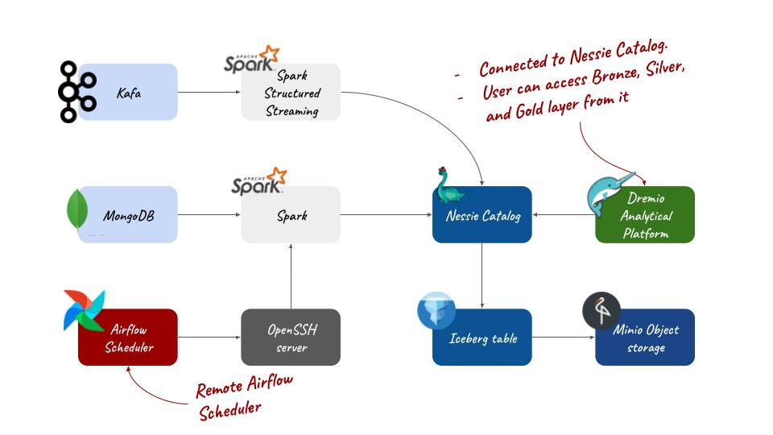
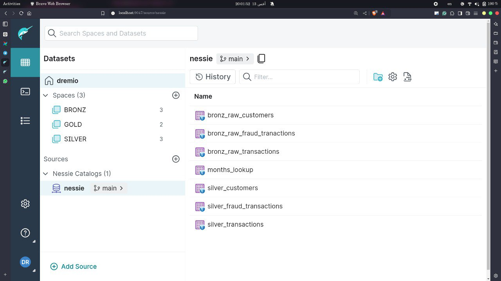
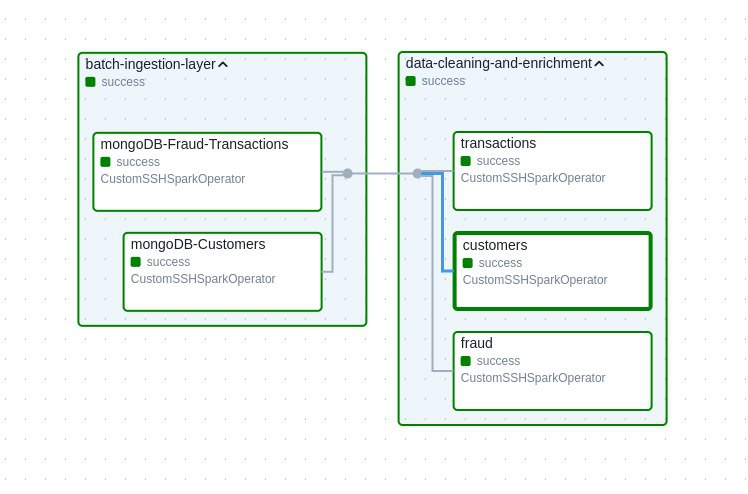

# Transactions Data Lake-house
>
> # Disclaimer
> - This setup IS NOT INTENDED FOR PRODUCTION USE.
> - This project is computing extensive, My laptop couldn't handle setting up all these containers at once. so during my development phase I was shutting down all unnecessary services.

# Stack
**MongoDB:** A NoSQL database used to store and manage unstructured data, enabling flexible schema design and horizontal scaling.

**Apache Kafka:** A distributed streaming platform for building real-time data pipelines and streaming applications, used for ingesting and processing data.

**Apache Spark:** An open-source distributed computing system optimized for big data processing, providing in-memory data processing capabilities and support for complex analytics.

**Apache Airflow:** A platform to programmatically author, schedule, and monitor data workflows, enabling automated and scalable data pipeline management.

**Nessie Catalog:** A transactional catalog that tracks changes to datasets, supporting versioned and multi-branch data management for data lakehouses.

**Iceberg:** An open table format for huge analytic datasets, designed for high performance and optimized for data lake environments.

**MinIO Object Storage (S3 compatible):** A high-performance, software-defined, S3-compatible object storage system for storing large amounts of unstructured data.

**Dremio:** A data lake query engine that enables fast and efficient querying of large datasets, often used for data analytics and business intelligence.

**Docker Compose:** A tool for defining and running multi-container Docker applications, simplifying the deployment and management of the project's entire stack.
# Introduction

This project is deployed using Docker Compose and consists of two networks: `airflow-network`, which contains Airflow-related containers, and `BigData-network`, which contains the remaining containers.

The `./includes` directory is mounted into the Spark cluster at `/`. The Spark cluster is triggered by Airflow using an **SSH** server. Check the `dockerfiles` directory for more details.

Kafka streams transaction data directly into Iceberg tables, while customer and fraud transaction data are ingested from a remote MongoDB.

MinIO, similar to an S3 bucket, is used to store Iceberg data and metadata, with the Nessie catalog responsible for managing this metadata.

Dremio provides a user-friendly UI for business and analytical users, allowing them to connect data to PowerBI, Tableau, etc. It also supports organizing tables into folders and spaces and setting permissions for each.
# Ingestion Layer
```plaintext
.
└──includes
   └── ingestion
       ├── kafka
       │   ├── load-kafka-stream-transactions.py
       │   └── tansactions-stream-sample.json
       └── mongoDB
           ├── clients.py
           ├── fraud.py
           └── common
               ├── ingest.py
               └── schema
                   ├── customers.py
                   └── fraud.py
```
## Kafka
Transaction data is published, processed by Apache Spark Structured Streaming, and stored in Iceberg tables in the bronze layer.

## Batch Ingestion
Airflow triggers Apache Spark and the PyMongo client to ingest data from the MongoDB source into Iceberg tables in the bronze layer. The module used to connect to MongoDB and retrieve the data is located in the `common` directory.
# Transformations
```plaintext
.
└──includes
│   ├── modules
│   │   ├── Data_cleaner
│   │   │   ├── Interface.py
│   │   │   └── Strategies
│   │   │       ├── base.py
│   │   │       ├── drop_duplicates.py
│   │   │       ├── drop_missing_values.py
│   │   │       ├── filter_negative_values.py
│   │   │       ├── __init__.py
│   │   │       ├── validate_columns_type.py
│   │   │       ├── validate_date.py
│   │   │       └── validate_regex.py
│   │   ├── file_utils
│   │   │   ├── base.py
│   │   │   ├── dir_handler.py
│   │   │   └── file_handler.py
│   │   └── SparkIcebergNessieMinIO
│   │       ├── CustomSparkConfig.py
│   │       └── spark_setup.py
│   └── python_scripts
│       ├── data-generators
│       │   ├── bank_app_simulation.py
│       │   └── start_kafka_producer.py
│       ├── data_lakehouse_init.py
│       └── data_operations
│           ├── helpers
│           │   └── jinja_templates_helper.py
│           └── silver
│               ├── customers.py
│               ├── fraud.py
│               └── transactions.py
└── jinja_templates
    ├── get_incremental_load_batch.sql
    ├── load_incremental_load_batch.sql
    ├── transform_to_silver_customers.sql
    ├── transform_to_silver_fraud.sql
    └── transform_to_silver_transactions.sql
```
Jinja templates are used for SQL transformations of the data, along with the `Data_cleaner` module, which includes several data cleaning strategies.      
Check the `./tests` directory for further usage instructions.
```python
# data cleaning module example
from includes.modules.SparkIcebergNessieMinIO.spark_setup import init_spark_session
from includes.modules.Data_cleaner.Strategies import (
    DropDuplicatesStrategy,
    DropMissingValuesStrategy,
)
from includes.modules.Data_cleaner.Interface import CleaningPipeline

cleaner = CleaningPipeline() #cleaner instance
cleaner.set_dataframe(df=batch)
cleaning_strategies = [
    DropDuplicatesStrategy(),
    DropMissingValuesStrategy(),
    # add more as you want
]

cleaner.add_strategy(cleaning_strategies)
cleaned_batch = cleaner.run()
```
# Analytical/Serving Layer

Bash scripts, Python, and Dremio REST API were employed to automatically set up the Dremio space, establish the Nessie connector, add a default user, and create Bronze, Silver, and Gold views.

# Airflow Dag

> Using SQLite as a backend DB and the Sequential Executor is not recommended and does not work properly in production.
## Batch Ingestion Sub-DAG:
This sub-dag ingests data from remote MongoDB database into Iceberg bronze tables 
```plaintext
# Triggered py files by Airflow
.
└── includes
    └── ingestion
        └── mongoDB
            ├── clients.py
            └── fraud.py
```
## Cleaning and Enrichment Sub-DAG:
This DAG transforms bronze tables into Silver tables.
```plaintext
# Triggered py files by Airflow
.
└── includes
    └── python_scripts
        └── data_operations
            └── silver
                ├── customers.py
                ├── fraud.py
                └── transactions.py
```
## Remote Spark SSH Custom Operator
This operator allows users to run remote `spark-submit` jobs via SSH. It ensures that the remote user can access important environment variables in the Spark cluster, such as `AWS_REGION`.
```plaintext
.
└── plugins
    └── operators
        └── ssh_spark.py
```
### Example
```python
from operators.ssh_spark import CustomSSHSparkOperator
# ..
# DAG definitions
# ..

ssh_spark_task1 = CustomSSHSparkOperator(
    task_id='mongoDB-Fraud-Transactions',
    ssh_conn_id='my_ssh_connection',
    application_path='/includes/ingestion/mongoDB/fraud.py',
)
```
# Bash Scripts

## start.sh
This script starts the Nessie, airflow, MinIO, mc, Zookeeper, and Kafka containers, updates the MinIO IP in `environment.env`, initializes the data lakehouse tables, sets up data streaming, configures the Airflow SSH connection, and writes to `/etc/profile` on the Spark master.

## Dremio
This script initializes Dremio views and spaces, and creates the default user.
> Default user **username:** dremio, **password:** dremio123

# Project Structure
```shell
$ tree -I '__pycache__|log*|env'
.
├── airflow-compose.yaml
├── assets
│   ├── serving layer.jpg
│   └── system-overview.jpg
├── config
├── dags
│   ├── fraud_data.py
│   └── ssh_test.py
├── db
│   └── airflow.db
├── docker-compose.yaml
├── dockerfiles
│   ├── airflow
│   │   ├── dockerfile
│   │   └── requirements.txt
│   └── spark
│       ├── dockerfile
│       ├── entrypoint.sh
│       └── requirements.txt
├── Dremio
│   ├── base.py
│   ├── dremio_init.py
│   └── dremio.py
├── dremio.sh
├── dremio_utils.sh
├── environment.env
├── includes
│   ├── explorer.py
│   ├── ingestion
│   │   ├── kafka
│   │   │   ├── load-kafka-stream-transactions.py
│   │   │   └── tansactions-stream-sample.json
│   │   └── mongoDB
│   │       ├── clients.py
│   │       ├── common
│   │       │   ├── ingest.py
│   │       │   └── schema
│   │       │       ├── customers.py
│   │       │       └── fraud.py
│   │       └── fraud.py
│   ├── modules
│   │   ├── Data_cleaner
│   │   │   ├── Interface.py
│   │   │   └── Strategies
│   │   │       ├── base.py
│   │   │       ├── drop_duplicates.py
│   │   │       ├── drop_missing_values.py
│   │   │       ├── filter_negative_values.py
│   │   │       ├── __init__.py
│   │   │       ├── validate_columns_type.py
│   │   │       ├── validate_date.py
│   │   │       └── validate_regex.py
│   │   ├── file_utils
│   │   │   ├── base.py
│   │   │   ├── dir_handler.py
│   │   │   └── file_handler.py
│   │   └── SparkIcebergNessieMinIO
│   │       ├── CustomSparkConfig.py
│   │       └── spark_setup.py
│   ├── python_scripts
│   │   ├── data-generators
│   │   │   ├── bank_app_simulation.py
│   │   │   └── start_kafka_producer.py
│   │   ├── data_lakehouse_init.py
│   │   └── data_operations
│   │       ├── helpers
│   │       │   └── jinja_templates_helper.py
│   │       └── silver
│   │           ├── customers.py
│   │           ├── fraud.py
│   │           └── transactions.py
│   └── SQL
│       ├── bronz
│       │   ├── init-raw-clients.sql
│       │   ├── init-raw-fraud_transactions.sql
│       │   └── init-raw-transactions.sql
│       ├── lookup
│       │   └── init-months-lookup.sql
│       └── silver
│           ├── init-customers.sql
│           ├── init-silver_fraud.sql
│           └── init-silver_transactions.sql
├── jinja_templates
│   ├── get_incremental_load_batch.sql
│   ├── load_incremental_load_batch.sql
│   ├── transform_to_silver_customers.sql
│   ├── transform_to_silver_fraud.sql
│   └── transform_to_silver_transactions.sql
├── plugins
│   └── operators
│       └── ssh_spark.py
├── producer.log
├── README.md
├── requirements.txt
├── spark_job.log
├── start.sh
├── tables.log
└── tests
    └── unit-tests
        ├── data-cleaner
        │   └── unit-test.py
        └── queries
            ├── customers_transformations.py
            ├── fraud_transformations.py
            └── transactions_transformations.py

36 directories, 70 files
```
